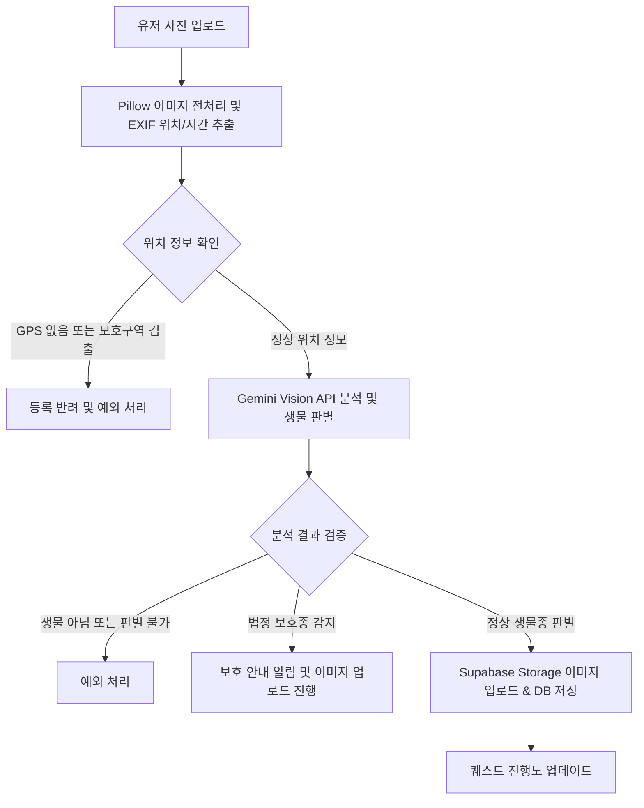

# 에코퀘스트 (EcoQuest)

에코퀘스트는 일상에서 만나는 생물에 대한 호기심을 수집형 게임 요소와 결합하여 해결하는 동시에, 생태학적으로 유용한 실시간 데이터를 수집 및 검증하는 데이터 플랫폼 서비스입니다.

---

## 1. 기획 배경 및 목적

- **생물에 대한 호기심 자극 및 지식 전달**
  일상 속 생물을 도감에 수집하고 가상 테라리움을 꾸미는 게임화 요소를 통해 생태 지식 습득의 경험을 제공합니다.
- **고품질 생태 데이터 수집 플랫폼 구축**
  기존의 도시권 생태 데이터 수집에 필요한 막대한 시간과 비용을 단축하고, AI 분석과 참여자의 기여를 응용한 검증을 결합하여 생태학자와 관련 기관에 적은 비용으로 신뢰도 높은 최신 생태 데이터를 제공합니다.
- **기존 서비스와의 차별점**
  단순한 생태 지도 기여 방식을 넘어 수집형 게임 경험를 제공하여 유저의 지속적인 참여를 유도합니다. 또한, AI 오류 및 거짓 데이터를 방지하기 위해 캡차(CAPTCHA) 형식의 검증 미니게임 시스템을 도입하여 데이터 신뢰도를 상호 검증합니다.

---

## 2. 핵심 기능

### ① 생물 렌즈 및 도감화

- 유저가 생물 사진을 업로드하면 이미지 메타데이터(촬영 시간, GPS 좌표)를 추출하여 유효성을 검증합니다.
- Gemini Vision API를 활용하여 사진 속 생물종을 1차 판별하고 도감에 등록합니다.
- 미수집 생물 발견 시 도감 등록 연출을 제공하며, 수집 진행 상황을 한눈에 볼 수 있도록 도감화합니다.

### ② 가상 테라리움

- 수집한 생물 및 퀘스트 보상으로 획득한 데코 아이템을 가상 테라리움 슬롯에 배치하여 자신만의 공간을 꾸밉니다.
- 저폴리곤(Low-Poly) 스타일의 3D 입체 SVG 코드를 활용하여 동적으로 테라리움을 렌더링하고 생태적 특성 학습을 돕습니다.

### ③ 퀘스트 시스템

- **일일 퀘스트**: 실시간 날씨 API 등 외부 환경 데이터를 기반으로 매일 유동적인 미션을 제공합니다.
- **연구자 퀘스트**: 생태학자 또는 공공 기관이 특정 지역이나 특정 생물의 데이터 수집을 원하는 경우, 이를 퀘스트(예: "참새 3마리 촬영하기") 형태로 발주하여 데이터를 수집하는 도구로 활용합니다.

### ④ 검증 미니게임

- 업로드된 사진의 허위 여부 및 AI 오판 가능성을 걸러내기 위해 타 유저들에게 퀴즈 형태로 생물종 맞추기 미니게임을 제공합니다.
- 다수결 합의 임계치를 통과하면 최종 생물종을 확정하며, 이에 참여한 유저에게는 경험치 및 테라리움 보상을 지급합니다.
- 비정상적인 빠른 응답(예: 500ms 미만)을 매크로로 간주하고 필터링하는 방지책이 내장되어 있습니다.

### ⑤ 생태계 보호 시스템

- 자연보호구역 내부 좌표에서 촬영된 사진이거나, 촬영 자체가 생태계 훼손을 유발할 수 있는 법정 보호종의 경우, 수집 보상 및 도감 등록 목표에서 제외하거나 대체 획득 경로를 제공함으로써 자연보호를 최우선으로 둡니다.

---

## 3. 기술 스택

- **Frontend**: Streamlit
- **Backend / Database**: Supabase (Auth, Database, Storage)
- **AI / Vision**: Gemini API (`google-genai` SDK)
- **Libraries**:
  - `psycopg[binary]`: PostgreSQL 데이터베이스 어댑터
  - `pandas`: 관리자 기능 통계 및 데이터 처리
  - `requests`: 외부 API 호출 (VWorld 행정구역 조회 등)
  - `pillow`: 이미지 전처리 (리사이징 및 EXIF 위치 정보 추출)
  - `pydantic`: 데이터 스키마 정의 및 유효성 검증

---

## 4. 데이터 흐름 및 검증 아키텍처



### 미니게임 기반 크라우드소싱 검증 프로세스

1. **대상 선정**: `Pictures` 테이블에서 최종 확정 생물종(`confirmed_dictionary_id`)이 없고, 본인이 업로드하지 않았으며 아직 투표하지 않은 사진을 선별합니다.
2. **사용자 응답 기록**: 미니게임을 통해 유저가 선택한 후보 종 정보를 `PictureTrust`에 기록합니다. (매크로 어뷰징 검출을 위해 `response_time` 동시 기록)
3. **합의 및 확정**: 투표 결과가 임계치를 초과할 시 사진 데이터의 생물종을 확정하고, 기여 유저의 `trust_score`(신뢰도) 및 경험치(`xp`)를 갱신합니다.

---

## 5. 데이터베이스 설계

데이터베이스는 기능별로 4개의 주요 도메인으로 설계되어 있습니다.

### ① 기준 정보 (Master Data)

- **`ItemsCategory`**: 데코용 아이템의 카테고리를 정의합니다. (분류 고유 번호, 분류 명칭, 카테고리 설명)
- **`Items`**: 테라리움 데코용 아이템 종류를 정의합니다. (아이템 고유 번호, 명칭, 소속 카테고리 ID)
- **`DictionaryCategories`**: 생물 대분류를 정의합니다. (분류 고유 번호, 분류 명칭, 분류 설명)
- **`Dictionary`**: 생물 도감 정보를 정의하며, 법정 보호종 여부를 관리합니다. (도감 고유 번호, 생물 명칭, 설명, 법정 보호종 여부, 소속 생물 분류 ID)
- **`TerrariumSlot`**: 테라리움에 아이템 장착이 가능한 슬롯 위치와 장착 가능한 카테고리를 제한합니다. (슬롯 고유 번호, 슬롯 이름, 설명, 장착 가능한 아이템 카테고리 ID)

### ② 유저 & 인벤토리 (User & Inventory)

- **`Users`**: 사용자 기본 정보 및 경험치, 신뢰도 점수를 관리합니다. (유저 UUID, 누적 경험치, 미니게임 신뢰도 상관계수, 가입 일시)
- **`UserInventory`**: 유저가 획득하여 보유한 테라리움 데코 아이템 목록입니다. (인벤토리 고유 번호, 유저 ID, 아이템 ID, 보유 수량, 획득 일시)
- **`UserTerrarium`**: 유저 개인 테라리움의 각 슬롯별 장착 아이템 정보입니다. (유저 ID, 슬롯 ID, 장착 아이템 ID)

### ③ 퀘스트 (Quest)

- **`Quest`**: 퀘스트의 설명 및 완료 보상 경험치, 만료 기한을 정의합니다. (퀘스트 고유 번호, 퀘스트 설명, 보상 경험치, 만료 일시)
- **`QuestReward`**: 퀘스트 완료 시 지급될 보상 아이템 정보입니다. (연결 퀘스트 ID, 보상 아이템 ID, 지급 수량)
- **`TargetDictionary`**: 퀘스트 달성을 위해 촬영해야 하는 목표 생물종 정보입니다. (연결 퀘스트 ID, 목표 생물 ID, 목표 횟수)
- **`TargetDictionaryCategories`**: 퀘스트 달성을 위해 촬영해야 하는 목표 생물 분류 정보입니다. (연결 퀘스트 ID, 목표 생물 분류 ID, 목표 횟수)
- **`UserQuest`**: 유저별 퀘스트 수행 상태를 기록합니다. (유저 ID, 퀘스트 ID, 상태 `in_progress` / `completed` / `expired`)
- **`QuestProgressDictionary`**: 유저별 생물종 타겟 퀘스트의 진행 상태를 기록합니다. (유저 ID, 퀘스트 ID, 목표 생물 ID, 촬영 성공 횟수)
- **`QuestProgressDictionaryCategories`**: 유저별 생물 분류 타겟 퀘스트의 진행 상태를 기록합니다. (유저 ID, 퀘스트 ID, 목표 생물 분류 ID, 촬영 성공 횟수)

### ④ 이미지 및 검증 (Image & Trust)

- **`Pictures`**: 유저가 수집하기 위해 업로드한 사진의 원본 메타데이터 및 AI 1차 분석 결과, 상호 검증 완료된 최종 결과를 관리합니다. (사진 고유 번호, 업로드 유저 ID, 스토리지 이미지 경로, GPS 위도/경도, AI 1차 추정 생물 ID, 상호 검증 최종 생물 ID, 업로드 일시)
- **`PictureCandidates`**: AI가 사진에 대해 추정한 생물종 후보 목록 및 확률 점수를 저장합니다. (사진 ID, 후보 생물 ID, 확신 점수)
- **`PictureTrust`**: 검증 미니게임에 참여한 유저들의 투표 정보 및 매크로 어뷰징 방지용 응답 시간을 기록합니다. (검증 유저 ID, 검증 대상 사진 ID, 유저가 투표한 생물 ID, 응답 시간, 응답 일시)

---

## 6. 설치 및 실행 방법

### ① 의존성 패키지 설치

로컬 개발 환경에 프로젝트의 필수 라이브러리를 설치합니다.

```bash
pip install -r requirements.txt
```

### ② Streamlit 애플리케이션 실행

설치가 완료되면 아래의 명령어를 입력하여 로컬 개발 서버를 기동합니다.

```bash
streamlit run app.py
```

개발 서버 실행 후 출력되는 브라우저 주소(`http://localhost:8501`)로 접속하여 서비스를 확인할 수 있습니다.
