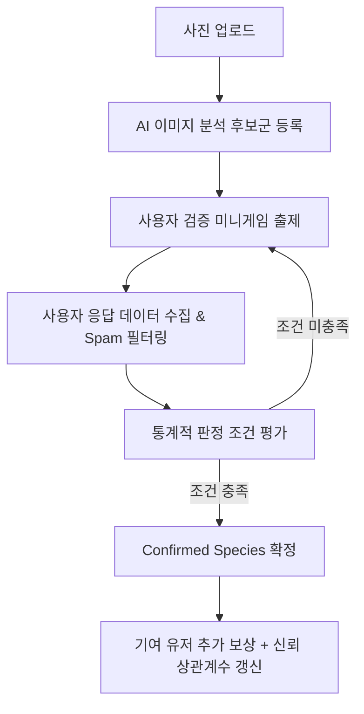

# AI 분석 및 집단지성 기반 생물종 통계적 확정 모델 (Species Confirmation Model)

본 문서는 에코퀘스트(EcoQuest) 플랫폼에서 업로드된 생물 사진을 통계학적 모델을 기반으로 검증하고 최종 확정(Confirm)하기 위해 구축된 수학적 알고리즘과 데이터베이스 처리 연동 규격을 설명합니다.

---

## 1. 알고리즘 개요

생물종의 최종 판정은 AI 예측 모델 점수(Confidence Score)와 다수 사용자들의 미니게임 검증 피드백(Picture Trust) 데이터를 수학적으로 융합하여 결정됩니다. 단순 다수결 방식의 한계를 극복하기 위해 **이항 가설 검정**과 **베이지안 추론** 모델을 도입하였습니다.

---

## 2. 세부 수학적 모델

### A. 이항 가설 검정 (Binomial Hypothesis Testing)
사용자의 투표 결과가 단순한 우연(무작위 찍기)에 의한 결과가 아님을 통계적으로 검증합니다.

* **귀무가설 ($H_0$)**: 사용자들이 생물종을 식별하지 못하고 4개의 후보 중 하나를 무작위로 선택했다 ($p_0 = 0.25$).
* **대립가설 ($H_1$)**: 사용자들이 올바른 식별 능력을 발휘하여 유의미하게 선택했다 ($p > 0.25$).

총 유효 투표수 $N$개 중 특정 생물종 후보 $S_k$가 $K$표를 득표했을 때, 귀무가설 하에서 우연히 $K$표 이상을 얻을 확률인 **p-value**를 이항분포의 누적분포함수로 구합니다.
$$\text{p-value} = P(X \ge K) = \sum_{x=K}^N \binom{N}{x} (p_0)^x (1 - p_0)^{N-x}$$
* **판정 임계치**: 계산된 p-value가 유의수준 $\alpha = 0.05$ 미만일 때 귀무가설을 기각하고, 해당 투표 결과가 통계적으로 유의미하다고 인정합니다.

---

### B. 베이지안 사후 확률 추론 (Bayesian Inference Model)
AI가 분석한 예측도를 사전 정보로 사용하고, 사용자 투표 데이터를 관측치로 받아 사후 확률(Posterior Probability)을 업데이트합니다.

#### 1) 사전 확률 (Prior Probability)
사진이 실제로 생물종 $S_k$일 사전 확률 $P(A_k)$는 AI의 후보군 신뢰도 점수를 정규화하여 설정합니다.
$$P(A_k) = \frac{\text{Confidence}(S_k)}{\sum_{j=1}^M \text{Confidence}(S_j)}$$
* $M$은 출제된 총 후보 종의 개수(기본 4개)입니다.

#### 2) 사용자 정확도(우도) 모델링
각 사용자 $i$의 신뢰도 점수인 **상관계수 $\rho_i \in [-1, 1]$**를 기반으로, 해당 유저가 참값인 생물종에 올바르게 투표할 확률(정확도) $p_i$를 선형 매핑합니다.
$$p_i = P(v_i = S_k \mid A_k) = \max\left(0, \frac{1}{M} + \left(1 - \frac{1}{M}\right)\rho_i\right)$$
* $\rho_i = 1$ (완벽한 양의 상관): $p_i = 1.0$ (항상 정답 투표)
* $\rho_i = 0$ (무상관): $p_i = \frac{1}{M} = 0.25$ (무작위 찍기 수준)
* $\rho_i < 0$ (음의 상관): 트롤 유저 및 악의적 참여자로 간주하여 **우도 연산 시 $\rho_i = 0.0$으로 가중치에서 배제**합니다.

사용자가 오답을 선택할 확률은 나머지 후보들에게 균등하게 분산된다고 가정합니다.
$$P(v_i = S_m \mid A_k) = \frac{1 - p_i}{M - 1} \quad (m \neq k)$$

#### 3) 사후 확률 (Posterior Probability) 계산
사용자들의 독립 투표 집합 $\mathbf{V} = \{v_1, v_2, \dots, v_n\}$이 관측되었을 때, 실제 종이 $S_k$일 최종 사후 확률 $P(A_k \mid \mathbf{V})$를 도출합니다.
$$P(A_k \mid \mathbf{V}) = \frac{P(\mathbf{V} \mid A_k) P(A_k)}{\sum_{j=1}^M P(\mathbf{V} \mid A_j) P(A_j)}$$
* 독립성 가정에 따라 우도 곱은 다음과 같습니다: $P(\mathbf{V} \mid A_k) = \prod_{i=1}^n P(v_i \mid A_k)$

---

### C. 사용자 신뢰 상관계수 갱신 및 감점 완화
최종 생물이 확정되었을 때, 검증에 참가한 사용자들의 상관계수 $\rho_u$를 지수이동평균(EMA) 방식으로 업데이트합니다.
$$\rho_{u, \text{new}} = (1 - \gamma) \rho_{u, \text{old}} + \gamma \cdot R_{\text{current}}$$
- **적응형 학습률 (Adaptive Gamma)**: 고정 학습률 대신 유저의 과거 유효 투표 참여 횟수 $n_u$에 따라 $\gamma$를 적응형으로 줄여나갑니다.
  $$\gamma(n_u) = \max\left(0.1, 0.5 \times 0.85^{n_u}\right)$$
- **개인 기여 점수 $R_{\text{current}}$**:
  * **정답 후보에 투표한 경우**: $R_{\text{current}} = +1.0$
  * **오답 후보에 투표한 경우 (패널티 완화)**: $R_{\text{current}} = -\frac{C}{M-1}$
    * 여기서 $C$는 최종 확정된 1위 종의 합의율(Consensus Ratio, $C = \frac{\text{1위 득표수}}{\text{총 유효 투표수}}$)입니다.
    * 헷갈리는 문제일수록 오답자에 대한 패널티가 줄어들어 부당한 불이익을 방지합니다.

---

## 3. 최종 확정 기준 (Confirmation Criteria)

특정 사진에 대해 아래 **3가지 기준**을 모두 충족하는 1위 후보 생물종 $S_{\text{best}}$가 존재할 때 시스템은 이를 최종 확정(Confirm) 처리합니다.

### A. 일반 조건
1. **통계적 유의성**: 이항 검정의 $\text{p-value} < 0.05$ (단, AI 신뢰도가 `0.1` 미만인 극단 오답 후보의 경우 이항 검정 조건을 **`p-value < 0.01`**로 강화하여 다수결의 횡포를 방어합니다.)
2. **높은 신뢰성**: 베이지안 사후 확률 $P(A_{\text{best}} \mid \mathbf{V}) \ge 0.95$
3. **최소 유효 표수**: 유효 투표수 $N \ge 3$ (AI 신뢰도가 `0.1` 미만인 극단 후보의 경우 최소 표수를 **`N >= 5`**로 강화합니다.)
   * Spam 필터링을 위해 응답 시간($\text{response\_time}$)이 **500ms 이상, 300,000ms(5분) 이하**인 투표만 유효 투표로 집계합니다.

### B. 콜드 스타트 시간 경과 완화 조건 (Timeout Confirmation)
유효 투표가 부족해 장기간 방치되는 것을 막기 위해 다음 조건 만족 시 예외적으로 확정합니다.
- 사진 등록 후 **7일 이상 경과**
- 유효 투표수 **$N \ge 1$** 및 합의율 **$C = 1.0$ (만장일치)**
- 확정하려는 종이 AI가 예측한 1위 후보와 일치하며, 해당 **AI 예측 신뢰도가 `0.8` 이상**인 경우

---

## 4. 데이터베이스 연동 및 관리자 정책

### A. 컬럼 변경 및 초기화
- `users.trust_score` 컬럼의 타입은 실수 계산을 수용하기 위해 `numeric` (또는 `float`) 타입으로 정의됩니다.
- 신규 사용자 및 기존 사용자의 초기 신뢰 상관계수 기본값은 **`0.2`**로 설정됩니다.

### B. 보상 시스템 연동
- **기본 참여 보상**: 미니게임 답변 제출 즉시 사용자에게 **XP +10**이 지급됩니다.
- **최종 기여 보상**: 사진 평가 결과 생물종이 최종 확정될 때, 정답을 선택했던 기여 유저들에게 **XP +20**이 추가적으로 데이터베이스를 통해 가산됩니다.

### C. 트롤 사용자 제한 정책
- 상관계수 점수가 **$\rho_u \le -0.2$** 이하로 떨어진 악의적인 유저 또는 지속적인 트롤러는 미니게임 검증 화면 진입 시 자격 제한 메시지와 함께 **24시간 동안 미니게임 참여가 차단**됩니다.

---

## 📅 업데이트 내역 요약 (Change Log)

* **2026-06-12 (v1.1) - 수학 모델 개정 및 보안 강화**:
  - 초기 신뢰 상관계수 기본값을 `0.1`에서 `0.2`로 보정하여 초기 성능 및 수렴 속도 제고.
  - 고정 학습률 대신 유저 누적 검증 횟수 기반 **적응형 학습률(Adaptive Gamma)** 산식 추가.
  - 진지한 대조 분석 유저를 위해 스팸 상한 시간을 60초에서 **300초(5분)**로 상향 완화.
  - 트롤 어뷰저 방지를 위해 상관계수 음수 유저의 가중치 배제($\rho=0.0$) 및 **$\rho_u \le -0.2$ 이하 24시간 미니게임 차단 정책** 수립 및 미니게임 페이지 연동.
  - 교착 방지용 **7일 경과 콜드 스타트 예외 확정 기준** 도입.
  - 공모 어뷰징 공격 방어용 **AI 신뢰도 연계 차등 확정 장벽(N>=5, p-value<0.01)** 규칙 도입.
